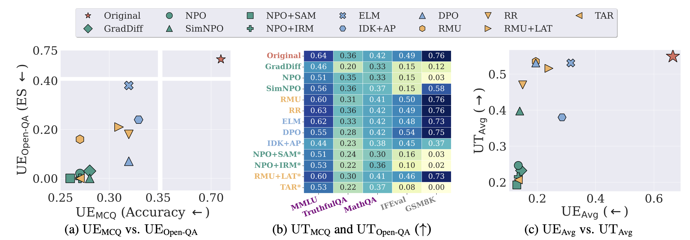

<div align='center'>

# LLM Unlearning Under the Microscope: A Full-Stack View on Methods and Metrics

</div>

<table align="center">
  <tr>
    <td align="center"> 
       
      <br>
      <em style="font-size: 18px;"> <strong>Figure 1.</strong> Unlearning effectiveness (UE) and utility retention (UT) evaluation of unlearning methods on WMDP with Llama-3 8B Instruction.
      (a) UE<sub>MCQ</sub> denotes accuracy on the WMDP evaluation set, and UE<sub>Open-QA</sub> denotes ES on the WMDP evaluation set. The arrow direction along each axis indicates the direction of better performance.
      (b) UT<sub>MCQ</sub> includes MMLU, TruthfulQA, and MathQA, while UT<sub>Open-QA</sub> includes IFEval and GSM8K.
      (c) UT<sub>Avg</sub> is defined as the mean of UT<sub>MCQ</sub> and UT<sub>Open-QA</sub>, and UE<sub>Avg</sub> is defined analogously. </em>
    </td>
  </tr>
</table>


This is the anonymous code repository accompanying the paper *"LLM Unlearning Under the Microscope: A Full-Stack View on Methods and Metrics"*, submitted to NeurIPS 2026 (Evaluations & Datasets Track) for double-blind review. Author and institutional information has been removed.


## Abstract

Machine unlearning for large language models (LLMs) aims to remove undesired data, knowledge, and behaviors (e.g., for safety, privacy, or copyright) while preserving useful model capabilities. Despite rapid progress over the past two years, research in LLM unlearning remains fragmented, with limited clarity on what constitutes effective unlearning and how it should be rigorously evaluated. In this work, we present a principled taxonomy of twelve recent stateful unlearning methods, grouped into three methodological families: divergence-driven optimization, representation misalignment, and rejection-based targeted unlearning. Building on this taxonomy, we revisit the evaluation of unlearning effectiveness (UE), utility retention (UT), and robustness (Rob), focusing on the WMDP benchmark. Our analysis shows that current evaluations, dominated by multiple-choice question (MCQ) accuracy, offer only a narrow perspective, often overstating success while overlooking the model's actual generation behavior. To address this gap, we introduce open question-answering (Open-QA) metrics that better capture generative performance and reveal the inherent UE-UT tradeoff across method families. Furthermore, we demonstrate that robustness requires finer-grained analysis: for example, vulnerabilities differ substantially between in-domain relearning and out-of-domain fine-tuning, even though both fall under model-level attacks. Through this study, we hope to deliver a full-stack revisit of LLM unlearning and actionable guidance for designing and evaluating future methods.

## Getting Started
1. Installation: To create a conda environment for Python 3.9, run:

    ```bash
    conda env create -f environment.yml
    conda activate wmdp
    ```

2. Get the data: Follow the [link](https://github.com/centerforaisafety/wmdp?tab=readme-ov-file) to download the WMDP-Bio dataset and place it in the `./WMDP/files/data`.

3. In-domain relearning:

    ```bash
    CUDA_VISIBLE_DEVICES=0,1,2,3 python src/exec/relearn_model.py \
        --config-file configs/unlearn/wmdp/Relearn+Forget.json \
        --overall.model_name {the path of unlearned model} \
        --unlearn.max_steps 100 \
        --logger.json.root {the path to save results}
    ```

4. Out-of-domain fine-tuning

    ```bash
    CUDA_VISIBLE_DEVICES=0,1,2,3 python src/exec/relearn_model.py \
        --config-file configs/unlearn/wmdp/Relearn+Forget.json \
        --overall.model_name {the path of unlearned model} \
        --unlearn.max_steps 250 \
        --dataset.batch_size 16 \
        --dataset.perturb_dataset_name {MNLI/SST2/GSM8K} \
        --logger.json.root {the path to save results}
    ```

5. Jailbreak attack
    - `git clone https://github.com/ethz-spylab/unlearning-vs-safety.git`.
    - Add the config of unlearned model in the `model_configs` of `unlearning-vs-safety/flrt_repo/flrt/util.py`. See the following example.
        ```bash
        "The name of unlearned model": ModelConfig(
            model_name="The path of unlearned model",
            peft_path=None,
            response_template="<|assistant|>\n",
            first_token="",
            system_prompt=None,
            sep=" ",
            tokenizer_name="HuggingFaceH4/zephyr-7b-beta",
        ),
        ```
    - Run the following command.
        ```bash
        CUDA_VISIBLE_DEVICES=0,1 python -m src.enhanced_gcg.flrt_repo.demo \
            --model_name_or_path {the path of unlearned model} \
            --optimize_prompts 0,2,3,4,5 \
            --wmdp_subset wmdp-bio \
            --use_static_representations \
            --dont_clamp_loss \
            --attack_layers 20 \
            --use_init npo-bio \
            --max_iter 1500
        ```

## Anonymity Notice

This repository has been prepared for double-blind review. All author identifiers, institutional affiliations, links to external homepages, public model collections, and prior version control history have been removed or replaced with neutral placeholders.
